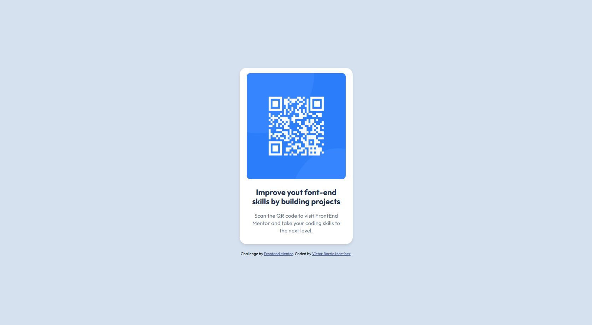

# Frontend Mentor - QR code component solution

This is a solution to the [QR code component challenge on Frontend Mentor](https://www.frontendmentor.io/challenges/qr-code-component-iux_sIO_H). Frontend Mentor challenges help you improve your coding skills by building realistic projects. 

## Table of contents

- [Overview](#overview)
  - [Screenshot](#screenshot)
- [My process](#my-process)
  - [Built with](#built-with)
  - [What I learned](#what-i-learned)
  - [Continued development](#continued-development)
  - [Useful resources](#useful-resources)

## Overview

### Screenshot

## My process

### Built with

- Semantic HTML5 markup
- CSS custom properties
- Flexbox

### What I learned

To do this challenge, i practiced more the basics of HTML and CSS. And also, use the flexbox to make the card responsive. Having a image with the result of the QR code and the text have me more facilitated to understand the code, and what i want to do.

### Continued development

I want to continue to practice the basics of HTML and CSS, and also, use the flexbox to familiarize myself with the code, and in the future i wnat to do it this challenges faster. So, if anione can help me to improve the code, or give me some advices, i will be very grateful!

### Useful resources

- The figma file helps me a lot to understand the code.
- Also i used the ChatGPT to help me when i was stuck in the code.